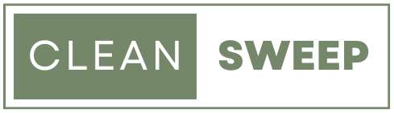

**What the project does?**

Clean Sweep is an app that will plan cleaning schedules for users based on how long ago it was done and how often a cleaning activity needs to be done. 

**Why is the project worthwhile?**

The idea of Clean Sweep is to remove the burden of remembering to do certain jobs, like washing the window in the upstairs bedroom or unpacking the fridge before the food in the back goes rotten. Often, we feel overwhelmed with so much on our plates, but if we can create a system, we can help people.

**How users can get started with the project?**

Users can create a log in. After Creating a login, users should be able to access their profiles, where they can start adding rooms and jobs.

**Where can users get help with your project?**

Users will always have access to a Contact Page, which allows them to type their details and send a message.

**Who contributes to the project?**

We are three student developers working collaboratively on this project:

1. Marietjie (MJ) Van der Westhuizen
2. Tanisha Dyer
3. Richard Hill

**How to run the Application using GitBash.**

Step 1: Clone our GitHub Repo. If you don't know how to clone a repo, please follow these instructions:

    https://docs.github.com/en/repositories/creating-and-managing-repositories/duplicating-a-repository

Step 2: navigate to the project directory where 'cleanSweep.py' is located.

Step 3: Set a virtual enviroment up by running the command:

    python -m venv venv

Step 4: Activate the virtual enviroment with the command:

    source venv/Scripts/activate

Step 5: Install denpendencies - with the virtual enviroment activated, run:

    pip install flask flask_sqlalchemy flask_login
and
   
    pip install flask_login

Step 6: ensure you are on the main branch in your terminal. You can switch to the main branch by typing:

    git checkout main

Step 7: Set enviroment variables:

*** Set the FLASK_APP environment variable: 

    export FLASK_APP=cleanSweep.py
                              
*** Set the FLASK_ENV environment variable: 

    export FLASK_ENV=development

Step 8: Run the Application - with the "flask run" command:

    flask run 

